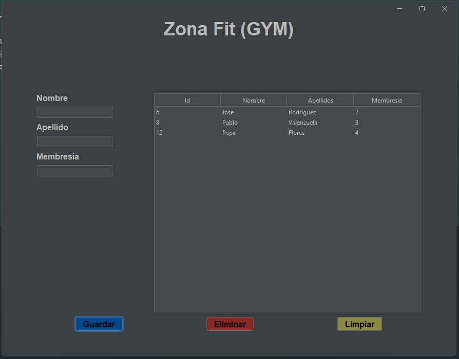

# 🏋️‍♂️ ZonaFit – Gestión de Clientes

Aplicación de escritorio desarrollada con **Java Swing** y **Spring Boot**, que permite gestionar clientes de un centro deportivo (alta, modificación, eliminación y listado).

Versión: `v3`  
Próxima versión: WebApp con API REST + frontend moderno

---

## 🛠 Tecnologías utilizadas

- ☕ Java 21
- 🎨 Swing (FlatDarculaLaf para tema oscuro)
- 🌱 Spring Boot (no web)
- 🗃️ Spring Data JPA
- 🧠 Lombok
- 🐘 Base de datos H2 en memoria (o configurable)
- 🖥️ Arquitectura: GUI ↔ Servicio ↔ Repositorio

---

## 📷 Captura de pantalla
   


---

## 📦 Funcionalidades implementadas

- [x] Crear nuevos clientes
- [x] Editar clientes existentes
- [x] Eliminar clientes
- [x] Listar todos los clientes
- [x] Validaciones básicas en formulario
- [x] Tema oscuro FlatLaf
- [x] GUI centrada y responsive básica

---

## 🧪 Estructura del proyecto

```shell
├── modelo/           # Clase Cliente (entidad JPA)
├── repositorio/      # Interfaz JpaRepository
├── servicio/         # Lógica de negocio (IClienteServicio + implementación)
├── gui/              # Interfaz gráfica (ZonaFitForma)
└── ZonaFitSwim.java  # Clase principal, inicia Spring y lanza Swing


